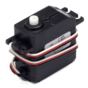
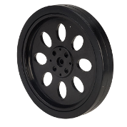
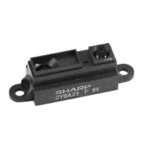
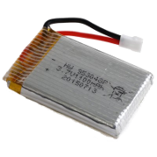

# The components used 

Here some of the components you can use to bulid your robot

| Image                    | Description                                                
|--------------------------|--------------------------------------------------------------------------|
|  | [C.U.B.I.E](https://www.newit.co.uk/shop/CubieTruck_Complete)| 
|  | Metal geared continuous servo motor                                      |
|   | [Solid servo wheel](http://bit.ly/1UIPs3U)                               |
|   | [Sharp GP2Y0A21Y0F](http://bit.ly/25U6HVd) distance sensor               |
|  | Lithium Polymer batteries 3.7V 1100mAh                            |

